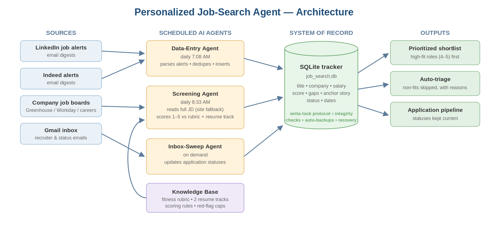

# Job-Search Agent

An autonomous AI pipeline that reads, scores, and tracks job postings — so your mornings start with a prioritized shortlist, not a haystack.

**[▶ Live interactive demo](https://maryistafanous.github.io/job-search-agent/)** · [Case study (PDF)](docs/case-study.pdf) · Built with [Claude Code](https://www.anthropic.com/claude-code) (headless agent runs + skills)



## What it does

Every morning, one unattended `claude -p` run works through four phases in strict order:

1. **Data entry** parses overnight job-alert emails (LinkedIn, Indeed), de-duplicates against everything already tracked, and inserts new roles into a local SQLite database.
2. **Career scan** proactively checks a rotating subset of your target companies' own career pages — catching roles that never hit the job boards — and feeds matches into the same pipeline.
3. **Screening** reads each pending posting — automatically falling back to the employer's own careers site when LinkedIn won't render the description — and scores it 1–5 against *your* written fitness rubric and *your* resume. It records salary (only if actually stated), key gaps, and the strongest interview "anchor story" for each role.
4. **Inbox sweep** triages application emails (Gmail labels are the processing state, so re-runs are idempotent), keeps every application's Status current, and drafts you a summary email.

A **live dashboard** (local FastAPI) shows high-fit not-yet-applied roles with one-click actions and writes status changes straight back to the database. A **resume-tailor** skill turns any high-fit row into an application kit on demand — ATS-optimized resume variant plus cover-letter draft, never fabricating experience.

Because the whole morning is ONE sequenced run, schedule collisions are impossible by construction — if the machine was asleep, the run simply fires once on wake, still in order.

Your job shrinks to reviewing a prioritized shortlist over coffee — and saying "prepare a kit for #12" when one deserves an application.

## Results (author's first 7 days)

| Metric | Result |
|---|---|
| Roles ingested and fully scored | 145 |
| Auto-triaged out, with documented reasons | 68% |
| High-fit roles (4–5) surfaced | 24 |
| Human time required | ~20 min/day |

## Design principles

- **Rubric as single source of truth** — scoring policy is a markdown file you edit, re-read on every run. Works for any profession: define your own dimensions, red flags, and score bands.
- **Honesty rules** — the agent never fabricates salaries, dates, or contacts. Partially-read postings are flagged `PROVISIONAL` with what would change the score.
- **One write path** — every database write goes through `scripts/job_db.py`: parameterized SQL, integrity checks before and after, de-duplication on application URL, and status updates only on an exact single-row match. Re-runs update, never duplicate.
- **Config-driven and generic** — all personal values (paths, email, labels, statuses) live in a gitignored `config.json`; the engine contains no personal data.

## What you need

- A Claude subscription and [Claude Code](https://www.anthropic.com/claude-code) (runs on your plan — no API key)
- Gmail receiving job-alert emails (connected via the built-in claude.ai Gmail connector)
- Chrome with the Claude extension (for the career-scan phase; it skips gracefully when Chrome is closed)
- Python 3 (standard library only) and your resume + 30 minutes to fill in the rubric template

See **[SETUP.md](SETUP.md)** for step-by-step instructions.

## Repo layout

```
CLAUDE.md              project instructions Claude Code loads every run
config.example.json    copy to config.json (gitignored) and point at your files
.claude/skills/        the pipeline skills: data-entry, career-scan, screening,
                       inbox-sweep, resume-tailor
pipeline/              morning-pipeline.md — the sequenced daily run
scripts/               job_db.py (single DB write path), run-pipeline.bat,
                       start-dashboard.bat
dashboard/             local FastAPI dashboard (backend + static UI)
db/                    SQLite schema for the tracker
templates/             your inputs: fitness rubric + search profile (fill these in)
docs/                  interactive demo (GitHub Pages site)
```

## Honest limitations

- Requires a Claude subscription; this is not a hosted service.
- LinkedIn postings are read through your own logged-in browser session (LinkedIn throttles and prohibits server-side scraping). The built-in fallback to employer career sites (Greenhouse/Workday/Lever) covers most gaps.
- Scheduled runs need the machine awake (Windows Task Scheduler; "run after missed start" recommended).
- Built and tested on one machine at a time; the tracker is a local SQLite file.

## License

MIT — see [LICENSE](LICENSE).
